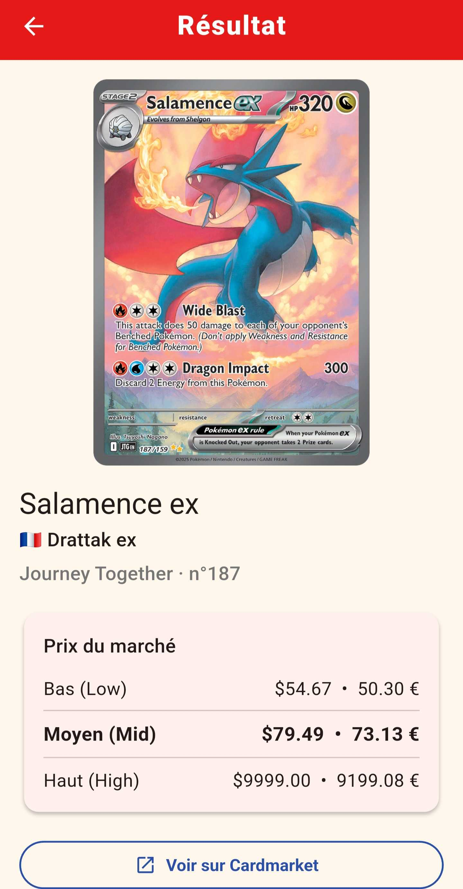

# PokéScan 🔴⚪

> Scanne une carte Pokémon avec ton téléphone et obtiens instantanément son **nom**, son **prix** et un lien vers **Cardmarket** — pensé pour les cartes **françaises**.

Application **Flutter** (Android) qui prend une photo d'une carte, lit le nom et le numéro par **OCR local** (Google ML Kit), interroge l'**API [TCGdex](https://tcgdex.dev)** (cartes en français natif) et affiche le **prix Cardmarket en euros**. Repli automatique sur l'API Pokémon TCG (anglais) si une carte manque.

<p align="center">
  
</p>

---

## ✨ Fonctionnalités

- 📸 **Scan photo** : capture figée à l'écran (pas besoin de garder le téléphone immobile pendant l'analyse).
- 🔤 **OCR local & gratuit** (Google ML Kit) : lit le **nom** (en haut à gauche) **et le numéro de collection** (« 146/131 ») de la carte.
- 🇫🇷 **Cartes françaises natives** via **TCGdex** : pas de traduction, « Pyroli » est reconnu directement. Le numéro de carte (« 014/131 ») cible le bon set et donc le bon prix.
- 💶 **Prix Cardmarket en euros** (Bas / Moyen / Tendance), mis à jour quotidiennement.
- 🔗 **Lien Cardmarket** vers la fiche de la carte.
- 🔢 **Numéro de carte** pour cibler la bonne édition (donc le bon prix).
- 🔎 **Recherche manuelle** (nom français + numéro) en repli si l'OCR échoue.
- ⏹️ **Bouton Annuler** pendant une recherche.
- 💾 **Historique local** (Hive) + **cache hors-ligne**.
- 🎨 **Charte graphique Pokémon** (rouge Pokéball, jaune Pikachu, logo Pokéball dessiné).

## 🧱 Stack technique

| Rôle | Techno |
|---|---|
| Framework | Flutter 3.x / Dart (Android + Web) |
| Caméra | `camera` (mobile) · `image_picker` (web) |
| OCR | `google_mlkit_text_recognition` (mobile) · **Tesseract.js** (web, sans clé) |
| Réseau | `http` → [TCGdex](https://tcgdex.dev) (FR + prix €) · repli [API Pokémon TCG](https://pokemontcg.io) |
| Stockage | `hive` / `hive_flutter` (historique + cache) |
| Liens externes | `url_launcher` (Cardmarket) |

## 🚀 Installation (Android)

> Prérequis : [Flutter](https://docs.flutter.dev/get-started/install) + un appareil Android (la caméra/OCR ne marchent pas sur émulateur).

```bash
cd pokemon_scanner
flutter pub get
flutter run            # sur un téléphone branché ou en débogage Wi-Fi
```

Pour générer un APK installable :
```bash
flutter build apk --release
# → build/app/outputs/flutter-apk/app-release.apk
```

## 🌐 Version web (iOS & navigateurs)

Pour permettre l'usage sur **iPhone** sans Mac/compte Apple, l'app a aussi une
cible **web** :

```bash
cd pokemon_scanner
flutter build web --release      # → build/web (à héberger : GitHub Pages, Netlify…)
flutter run -d chrome            # test local
```

Différences avec le mobile :
- 📸 La capture passe par l'appareil photo du navigateur (`image_picker`), ce qui
  marche **sur iOS Safari**.
- 🔤 L'OCR utilise **Tesseract.js** (WASM, gratuit, sans clé, 100 % local) car
  ML Kit n'existe pas en navigateur. Précision moindre que sur mobile → la
  **recherche manuelle (nom + numéro)** reste le repli fiable.
- Le choix mobile/web se fait par **compilation conditionnelle** (`lib/app_home.dart`,
  `lib/services/ocr_service.dart`) ; aucun code natif n'est inclus dans le build web.

## 🗂️ Architecture (`pokemon_scanner/lib/`)

```
main.dart                  # init Hive + thème Pokémon
app_home.dart              # choix accueil mobile/web (compilation conditionnelle)
theme.dart                 # palette PokeColors
models/pokemon_card.dart   # modèle + prix + lien Cardmarket
services/
  ocr_service.dart         # dispatcher OCR mobile/web
  ocr_heuristics.dart      # heuristiques nom/numéro (partagées)
  ocr_service_mobile.dart  # OCR ML Kit (mobile)
  ocr_service_web.dart     # OCR Tesseract.js (web)
  name_translator.dart     # traduction FR↔EN (pour le repli + le lien CM)
  pokemon_api.dart         # TCGdex (primaire) + repli pokemontcg.io, cache
  history_service.dart     # stockage Hive du Pokédex
screens/                   # scan (mobile), web_home (web), result, pokedex
widgets/                   # price_card, pokeball_icon, pokedex_icon
assets/fr_en_pokemon.json  # 1025 noms FR→EN (repli pokemontcg + lien Cardmarket)
```

## 📝 Notes

- [TCGdex](https://tcgdex.dev) est gratuite, multilingue et **sans clé**, avec prix Cardmarket/TCGplayer inclus. L'API Pokémon TCG sert de repli (1000 req/jour sans clé).
- PokéCardex n'expose **pas** d'API publique (confirmé sur leur forum) — TCGdex est la meilleure source FR.
- Hive est utilisé **sans codegen** (sérialisation JSON) → aucune commande `build_runner` nécessaire.

---
