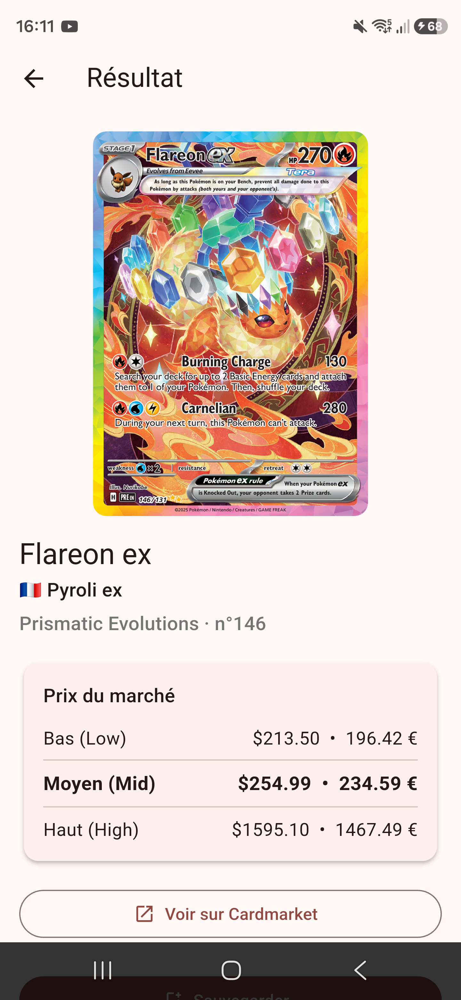

# PokéScan 🔴⚪

> Scanne une carte Pokémon avec ton téléphone et obtiens instantanément son **nom**, son **prix** et un lien vers **Cardmarket** — pensé pour les cartes **françaises**.

Application **Flutter** (Android) qui prend une photo d'une carte, lit le nom et le numéro par **OCR local** (Google ML Kit), traduit le nom français en anglais, interroge l'**API Pokémon TCG** et affiche les prix en **€ et $**.

<p align="center">
  
</p>

---

## ✨ Fonctionnalités

- 📸 **Scan photo** : capture figée à l'écran (pas besoin de garder le téléphone immobile pendant l'analyse).
- 🔤 **OCR local & gratuit** (Google ML Kit) : lit le **nom** (en haut à gauche) **et le numéro de collection** (« 146/131 ») de la carte.
- 🇫🇷 **Cartes françaises** : dictionnaire de **1025 Pokémon FR→EN** embarqué (l'API n'indexe que l'anglais). « Pyroli ex » → « Flareon ex ». Comparaison **sans accents** et tolérante aux fautes d'OCR.
- 💶 **Prix** Bas / Moyen / Haut en **euros et dollars**.
- 🔗 **Lien Cardmarket** vers la fiche de la carte.
- 🔢 **Numéro de carte** pour cibler la bonne édition (donc le bon prix).
- 🔎 **Recherche manuelle** (nom français + numéro) en repli si l'OCR échoue.
- ⏹️ **Bouton Annuler** pendant une recherche.
- 💾 **Historique local** (Hive) + **cache hors-ligne**.
- 🎨 **Charte graphique Pokémon** (rouge Pokéball, jaune Pikachu, logo Pokéball dessiné).

## 🧱 Stack technique

| Rôle | Techno |
|---|---|
| Framework | Flutter 3.x / Dart |
| Caméra | `camera` |
| OCR | `google_mlkit_text_recognition` (local, gratuit) |
| Réseau | `http` → [API Pokémon TCG](https://pokemontcg.io) |
| Stockage | `hive` / `hive_flutter` (historique + cache) |
| Liens externes | `url_launcher` (Cardmarket) |

## 🚀 Installation (Android)

> Prérequis : [Flutter](https://docs.flutter.dev/get-started/install) + un appareil Android (la caméra/OCR ne marchent pas sur émulateur).

```bash
cd pokemon_scanner
flutter pub get
flutter run            # sur un téléphone branché ou en débogage Wi-Fi
```

Pour générer un APK installable :
```bash
flutter build apk --release
# → build/app/outputs/flutter-apk/app-release.apk
```

## 🍎 iOS

Le code est prêt (permissions caméra incluses dans `ios/Runner/`), mais compiler/distribuer pour iPhone nécessite un **Mac (ou un build cloud type Codemagic)** et un **compte Apple Developer** pour passer par TestFlight.

## 🗂️ Architecture (`pokemon_scanner/lib/`)

```
main.dart                  # init Hive + caméras + thème Pokémon
theme.dart                 # palette PokeColors
models/pokemon_card.dart   # modèle + prix + lien Cardmarket
services/
  ocr_service.dart         # extraction nom + numéro (ML Kit)
  name_translator.dart     # traduction FR↔EN (sans accents, tolérante)
  pokemon_api.dart         # recherche API (nom+numéro, retries, cache)
  history_service.dart     # historique Hive
screens/                   # scan, result, history
widgets/                   # price_card, pokeball_icon
assets/fr_en_pokemon.json  # 1025 noms FR→EN (généré depuis PokéAPI)
```

## 📝 Notes

- L'API Pokémon TCG est gratuite (1000 req/jour sans clé ; clé gratuite illimitée sur [pokemontcg.io](https://pokemontcg.io)).
- Hive est utilisé **sans codegen** (sérialisation JSON) → aucune commande `build_runner` nécessaire.

---
